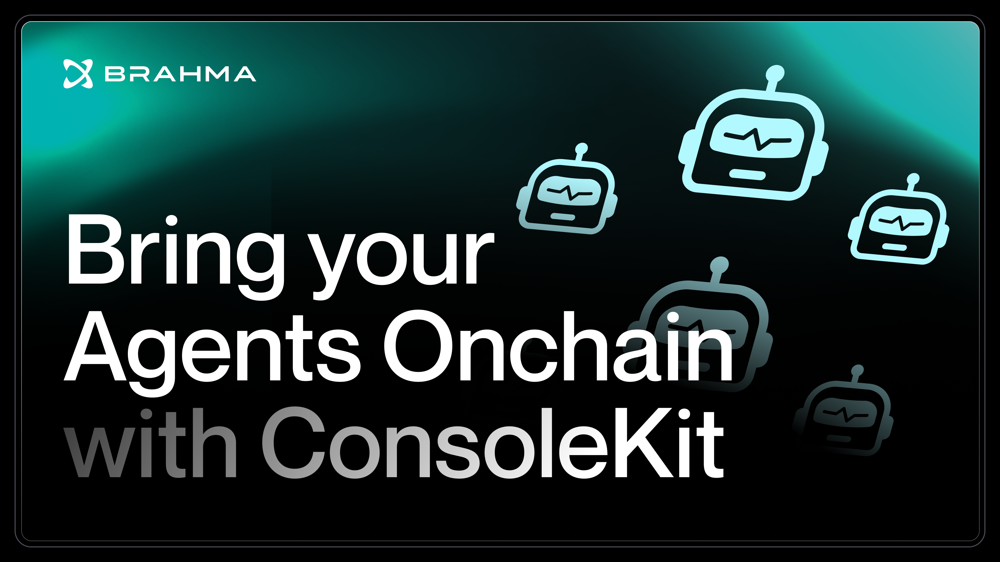

# ConsoleKit

ConsoleKit enables agents to execute complex DeFi transactions on-chain. Any agent with any model can now transact autonomously with battle-tested security guardrails.

- Manage user funds and execute complex operations at scale
- Access modular functions for DeFi primitives: optimal routing, MEV protection, cross-chain liquidity
- Users keep full custody and delegate access to Agents
- Deploy agents on any interface: your website, telegram, or custom frontend
- Enable cross-chain interactions with same programmable account and execution capabilities
- Prevent unauthorized transactions with on-chain policy enforcement
- Skip the complexity: accounts, policies, execution, RPC management all handled

## What are Agents?

At their core, agents are automated decision-makers that execute your on-chain interactions. They monitor conditions, execute transactions, and manage positions based on predefined logic. Here's what makes them powerful:

- **Always-On Execution**: Your agent can continuously monitor markets and execute operations
- **Programmable Logic**: Define sophisticated conditions and actions using ConsoleKit's DeFi primitives
- **Built-in Safety**: Every agent inherits Console's policy engine, protecting user funds with customizable constraints

### Making Agents Smarter

While agents execute the strategies, you can enhance their decision-making by connecting them to external intelligence sources:

- **Market Intelligence**: Connect to price oracles, sentiment analyzers, and trading signal providers
- **On-Chain Analytics**: Integrate on-chain data providers for wallet behavior, protocol metrics, and liquidity analysis
- **Custom AI Models**: Plug in your own trained models for specialized strategy execution

These intelligence sources can be powered by AI models. For example, a DCA agent can be made smarter by:

- Using sentiment analysis models to adjust buy amounts based on social media trends and news
- Analyzing whale wallet movements to detect accumulation/distribution patterns
- Learning from historical market behavior to optimize entry timing across different market conditions

**ConsoleKit handles the secure execution** while you focus on integrating these intelligence systems.

### Interfacing with Users

DeFi agents often involve complex parameters and operations. Make them accessible through natural language interfaces so users can interact conversationally instead of setting technical parameters.

Turn "Set a DCA strategy for 1000 USDC into ETH over 30 days with increased buys during high sentiment periods" into executable actions.

Check out these examples demonstrating how to interface ConsoleKit agents with popular AI frameworks like openAi SDK, and langChain or directly as MCP server:

- [MCP](https://github.com/Brahma-fi/scaffold-agent/tree/ft-mcpserver)
- [OpenAI SDK](https://github.com/Brahma-fi/scaffold-agent/tree/ft-addOpenAi)
- [LangChain](https://github.com/Brahma-fi/scaffold-agent/tree/ft-addLangchain)
