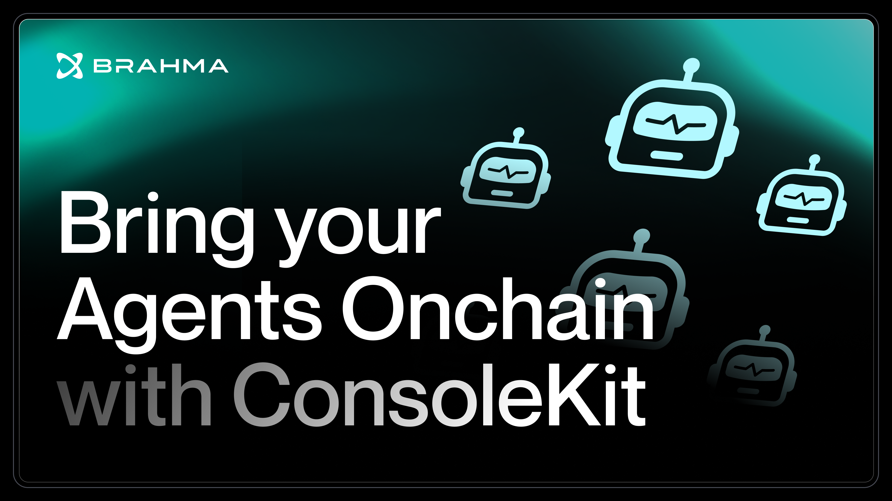

# ConsoleKit

ConsoleKit enables agents to execute complex DeFi transactions on-chain. Any agent with any model can now transact autonomously with battle-tested security guardrails.

- Manage user funds and execute complex operations at scale
- Access modular functions for DeFi primitives: optimal routing, MEV protection, cross-chain liquidity
- Users keep full custody and delegate access to Agents
- Deploy agents on any interface: your website, telegram, or custom frontend
- Enable cross-chain interactions with same programmable account and execution capabilities
- Prevent unauthorized transactions with on-chain policy enforcement
- Skip the complexity: accounts, policies, execution, RPC management all handled

## What are Agents?

At their core, agents are automated decision-makers that execute your on-chain interactions. They monitor conditions, execute transactions, and manage positions based on predefined logic. Here's what makes them powerful:

- **Always-On Execution**: Your agent can continuously monitor markets and execute operations
- **Programmable Logic**: Define sophisticated conditions and actions using ConsoleKit's DeFi primitives
- **Built-in Safety**: Every agent inherits Console's policy engine, protecting user funds with customizable constraints

### Making Agents Smarter

While agents execute the strategies, you can enhance their decision-making by connecting them to external intelligence sources:

- **Market Intelligence**: Connect to price oracles, sentiment analyzers, and trading signal providers
- **On-Chain Analytics**: Integrate on-chain data providers for wallet behavior, protocol metrics, and liquidity analysis
- **Custom AI Models**: Plug in your own trained models for specialized strategy execution

These intelligence sources can be powered by AI models. For example, a DCA agent can be made smarter by:

- Using sentiment analysis models to adjust buy amounts based on social media trends and news
- Analyzing whale wallet movements to detect accumulation/distribution patterns
- Learning from historical market behavior to optimize entry timing across different market conditions

**ConsoleKit handles the secure execution** while you focus on integrating these intelligence systems.

### Interfacing with Users

DeFi agents often involve complex parameters and operations. Make them accessible through natural language interfaces so users can interact conversationally instead of setting technical parameters.

Turn "Set a DCA strategy for 1000 USDC into ETH over 30 days with increased buys during high sentiment periods" into executable actions.

Check out these examples demonstrating how to interface ConsoleKit agents with popular AI frameworks like elizaOS, openAi SDK, and langChain:

- [ElizaOS](https://github.com/Brahma-fi/scaffold-agent/tree/ft-addEliza)
- [OpenAI SDK](https://github.com/Brahma-fi/scaffold-agent/tree/ft-addOpenAi)
- [LangChain](https://github.com/Brahma-fi/scaffold-agent/tree/ft-addLangchain)

## System Architecture & Core Concepts

The [System Architecture & Core Concepts documentation](./docs/introduction.md) provides a comprehensive overview of ConsoleKit's design principles, components, and terminology. This section is essential reading for developers to understand:

- Core architectural components and their interactions
- Key terminologies and concepts used throughout the SDK
- Security model and policy engine fundamentals
- Integration patterns and best practices

We recommend reviewing this documentation before starting development to ensure a solid foundation in ConsoleKit's principles.

## Installation

To install the SDK, use npm or yarn:

```sh
npm install brahma-console-kit
```

or

```sh
yarn add brahma-console-kit
```

## Getting Started with Template

To quickly bootstrap your ConsoleKit project, you can use our [scaffold agent repository](https://github.com/Brahma-fi/scaffold-agent)

[](https://www.youtube.com/watch?v=pLGP0Ag1Y8M)

The scaffold repository includes a collection of example implementations showcasing how to build autonomous DeFi agents using ConsoleKit. This repository demonstrates integration patterns ranging from LLM-powered execution to automated DeFi workflows.

## Overview

### ConsoleKit

[`ConsoleKit`](./src/kit.ts) is the main class that provides access to the core functionalities of the SDK. It requires an API key and a base URL for initialization.

**Example:**

```typescript
import ConsoleKit from "brahma-console-kit";

const apiKey = "your-api-key";
const baseURL = "https://api.consolekit.com";

const consoleKit = new ConsoleKit(apiKey, baseURL);
```

### CoreActions

[`CoreActions`](./src/helpers/CoreActions/index.ts) provides core DeFi functions such as sending tokens and swapping assets, as well as fetching user information.

**Example:**

```typescript
const coreActions = consoleKit.coreActions;

async function fetchAccounts(eoa: string) {
  const accounts = await coreActions.fetchExistingAccounts(eoa);
  console.log(accounts);
}
```

### PublicDeployer

[`PublicDeployer`](./src/helpers/PublicDeployer/index.ts) handles executor subscription and brahma account deployments directly through EOAs in a gasless manner.

**Example:**

```typescript
const publicDeployer = consoleKit.publicDeployer;

async function deployStrategy(
  owner: string,
  chainId: number,
  feeToken: string
) {
  const preComputeData = await publicDeployer.fetchPreComputeData(
    owner,
    chainId,
    feeToken
  );
  console.log(preComputeData);
}
```

### AutomationContext

[`AutomationContext`](./src/helpers/AutomationContext/index.ts) manages automation services, including subscribing to, updating, and canceling automated tasks.

**Example:**

```typescript
const automationContext = consoleKit.automationContext;

async function subscribeToAutomation(params: any) {
  const response = await automationContext.subscribeToAutomation(params);
  console.log(response);
}
```

#### Fetching Automations with Custom Metadata

ConsoleKit provides flexible functions to fetch automation subscriptions with customizable metadata. This allows you to tailor the metadata structure to your specific needs.

##### Fetching Automation Subscriptions

The `fetchAutomationSubscriptions` function retrieves subscriptions associated with a given account address and blockchain network. You can specify a custom metadata type, or use the default structure.

- **Default Metadata**: If no template is provided, the metadata will include only `baseToken` and `every`. See the [BaseMetadata](./src/helpers/AutomationContext/types.ts#L1) type definition.
- **Custom Metadata**: Specify a template to include additional fields. See the [CustomMetadata](./src/helpers/AutomationContext/types.ts#L4) type definition.

**Example:**

```typescript
// Default metadata
const subscriptions = await automationContext.fetchAutomationSubscriptions(
  accountAddress,
  chainId
);

// Custom metadata
type CustomMetadata = { customField1?: string; customField2?: number };
const customSubscriptions =
  await automationContext.fetchAutomationSubscriptions<CustomMetadata>(
    accountAddress,
    chainId
  );
```

##### Fetching EOA Automation Subscriptions

The `fetchEoaAutomationSubscriptions` function retrieves subscriptions for a specific externally owned account (EOA) and executor ID. Similar to the previous function, you can specify a custom metadata type.

- **Default Metadata**: If no template is provided, the metadata will include only `baseToken` and `every`. See the [BaseMetadata](./src/helpers/AutomationContext/types.ts#L1) type definition.
- **Custom Metadata**: Specify a template to include additional fields. See the [CustomMetadata](./src/helpers/AutomationContext/types.ts#L4) type definition.

**Example:**

```typescript
// Default metadata
const subscriptions = await automationContext.fetchEoaAutomationSubscriptions(
  eoa,
  executorId
);

// Custom metadata
type CustomMetadata = { customField1?: string; customField2?: number };
const customSubscriptions =
  await automationContext.fetchEoaAutomationSubscriptions<CustomMetadata>(
    eoa,
    executorId
  );
```

This overview provides a basic understanding of how to initialize and use the main classes in the `ConsoleKit` SDK. For more detailed usage, refer to the documentation or explore the source code.

## Brahma Accounts Security Audits

Security audits performed on Brahma accounts. Please refer to the following reports for detailed security analysis and findings:

- [Spearbit Audit Report](https://github.com/spearbit/portfolio/blob/master/pdfs/Brahma-Spearbit-Security-Review.pdf)
- [Code4rena Audit Report](https://code4rena.com/audits/2023-10-brahma#top)
- [Ackee Blockchain Audit Report](https://github.com/Ackee-Blockchain/public-audit-reports/blob/master/2023/ackee-blockchain-brahma-console-v2-report.pdf)

## License

This project is licensed under the MIT License.

### Note

Safe Agenthon api-key: `65832024-c1f4-48d2-81e6-3460f2722600` and url: `https://dev.console.fi/`
