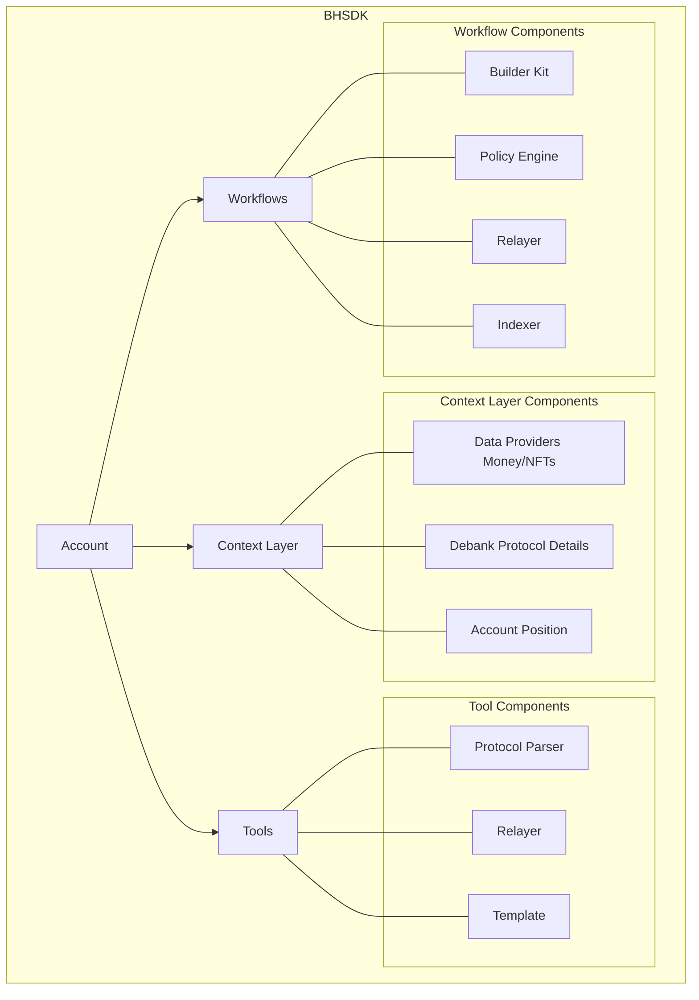

# Introduction 

Brahma sdk (bhsdk) is platform that enable agents to operate, transact onchain autonomously. Agents use account as the main interaction point with the platform. The account is assisted by tools, workflows and context layer to operate onchain in efficient and secure manner. The core components are open in nature so dev's can add new capabilities from exisiting ones. 

# Tools
Tools are the building blocks of the platform. They are used to perform one time specific transactions with the onchain protocols. Tools are built using the parameters as input and execution calldata as output. Tools have the following structure: 
- Input: {`id`, `params`}
- Function: {
    - Call data api's for constructing protocol fuctions based on `params`
    - Constructing the final batched calldata for all actions 
}
- Output: {`calldata`}

All the tools are organised into `Templates` so they have definitions that ensure enable them to called either via API or directly as tool by Agent. 

# Workflows
Workflows are series of onchain interactions which are trigger or scheduled based. They provide good abstraction to the underlying blockchain interactions so devs can focuse on the highlevel operation logic while getting the benefits of reliable execution in pure non-custodial manner. Workflow's are built with `BuilderKit` as core component that uses the `Policy Engine` for validating actions, `Relayer` for gasfree reliable transactions across multiple chains, `Indexer` for reacting based on onchian events. Dev's can use the public workflows to build and customise it to their own usecase. They can run these workflows either on their infra or hosted one from Brahma. 

# Context Layer
Context layer is integration repository that helps fetch data from different providers. This is used by `Workflows` and `Tools` to have realtime information for their operations. The info falls under two categories: 
1. Onchain: Protocol Specific info, Account Specific Info from providers like Defillama, DeBank, Kaito. 
2. Offchain: This would be from social platforms like Twitter, Telegram, Discord, Coingecko. 

