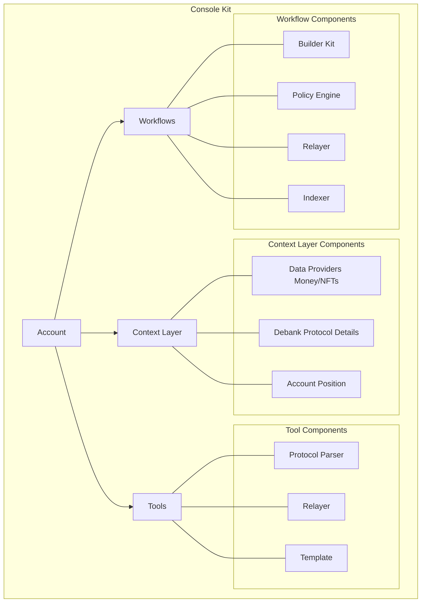

# Introduction 

ConsoleKit empowers developers to build specialized agents that operate autonomously onchain. It addresses the core challenges developers face when building onchain execution systems for agents, focusing on three key areas:
1. Secure Interactions
2. Simplified Development
3. Scalable Operations

## Secure Interactions
### How does ConsoleKit enable secure interactions?
ConsoleKit uses smart accounts as the main interaction point. Each account is built with Safe [smart contract wallets](https://safe.global/), leveraging [Safe Guards](https://docs.safe.global/advanced/smart-account-guards) and [Safe Modules](https://docs.safe.global/advanced/smart-account-modules) to enable programmatic executions without giving up the custody of the account. The guard is powered by the `Policy Engine`, validating all onchain interactions through state updates, transaction simulations and logs.  

## Simplified Development
### How does ConsoleKit simplify application code for onchain interactions?
By shifting the core part of block chain interaction like protcol routes, failed rpc calls, nonce management, gas estimates to platform. There's less application code for dev's to manage and they can focus on their specific usecase and business logic. The native abstractions like tools, workflows and context layer makes it easy to repurpose existing components and build completely new components reducing overhead during development time. 
With its API-driven design, developers can integrate ConsoleKit using their preferred programming language, ensuring flexibility and ease of implementation.

## Scalable Operations
### How does ConsoleKit help build scalable operations?
ConsoleKit enables developers to build operations that can seamlessly scale from single-chain to multi-chain deployments with minimal code changes. Unlike traditional smart contract development, which often involves expensive audits and slow iteration cycles, ConsoleKit's account-centric model allows for rapid iteration and adaptation to specific use cases.
The platform handles infrastructure maintenance, allowing teams to deploy the same code across different users with their specific preferences. This shared infrastructure approach significantly reduces maintenance overhead while maintaining individual user customization capabilities.

# Use Cases
- Tools (for interactions like swap, deposit, bridge)
    - Ready-to-use functions for basic interactions:
        - Swap tokens across any DEX
        - Bridge assets between chains
        - Deposit/withdraw from lending protocols

- Workflows (complex automated flows)
    - Complex trigger or Time based interactions
        - TWAP execution for large orders
        - Yield optimization across protocols
        - Cross-chain liquidity management
    - Developers can share workflows or host them private

# Getting Started
Console Kit uses Brahma Accounts as the main mode of interaction. The account is assisted by tools, workflows and a context layer to operate onchain in efficient and secure manner. The core components are open in nature so devs can always expand capabilities from exisiting ones. 

Developers can start with:
- the [Brahma-Builder](https://github.com/Brahma-fi/brahma-builder) for building their custom workflows
- [Brahma-Templates-SDK](https://github.com/Brahma-fi/brahma-templates-sdk) for building their custom tools. 
 
 ### Next Section
- [Workflows](./Workflows.md)
- [Tools](./Tools.md)
- [Context Layer](./ContextLayer.md)

