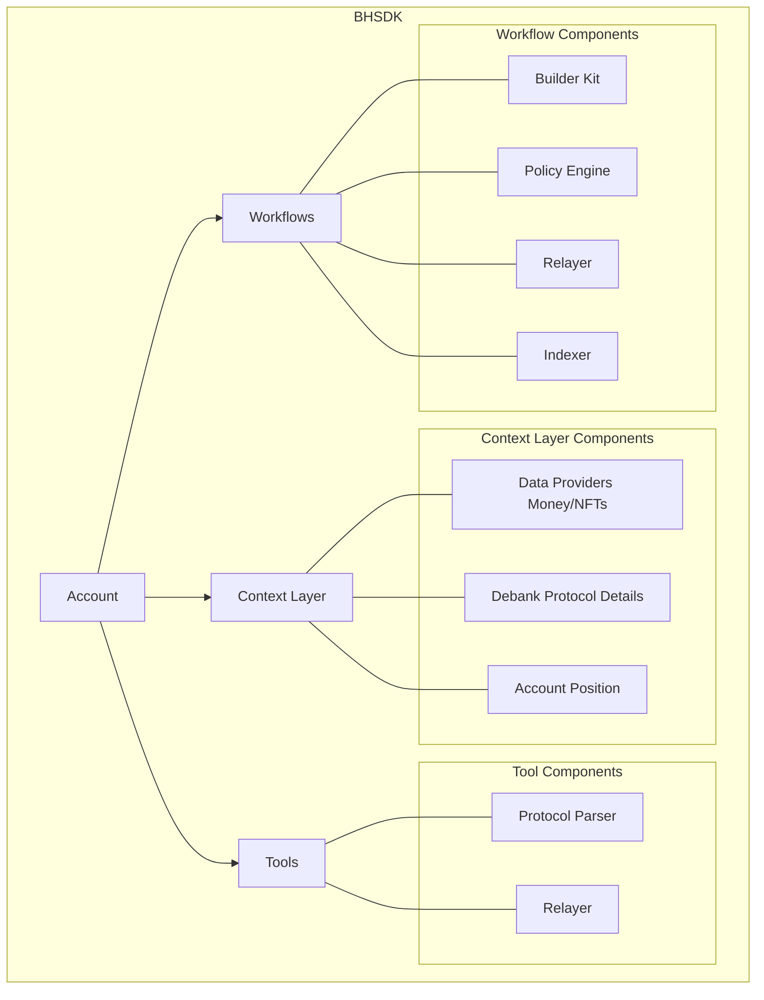

# Introduction 

Brahma sdk (bhsdk) is platform that enable agents to operate, transact onchain autonomously. The platform is composed of 3 components that assist the account in the center.

```mermaid
graph TD
    subgraph BHSDK
        A[Account] 
        A --> C[Context Layer]
        A --> D[Workflows]
        A --> E[Tools]
        
        subgraph Tool Components
            PP[Protocol Parser]
            R1[Relayer]
        end
        
        subgraph Context Layer Components
            CL[Data Providers Money/NFTs]
            DP[Debank Protocol Details]
            AP[Account Position]
        end
        
        subgraph Workflow Components
            B2[Builder Kit]
            P[Policy Engine]
            R2[Relayer]
            I[Indexer]
        end
        
        C --- CL
        C --- DP
        C --- AP
        
        D --- P
        D --- R2
        D --- I
        D --- B2

        E --- PP
        E --- R1
    end
```

