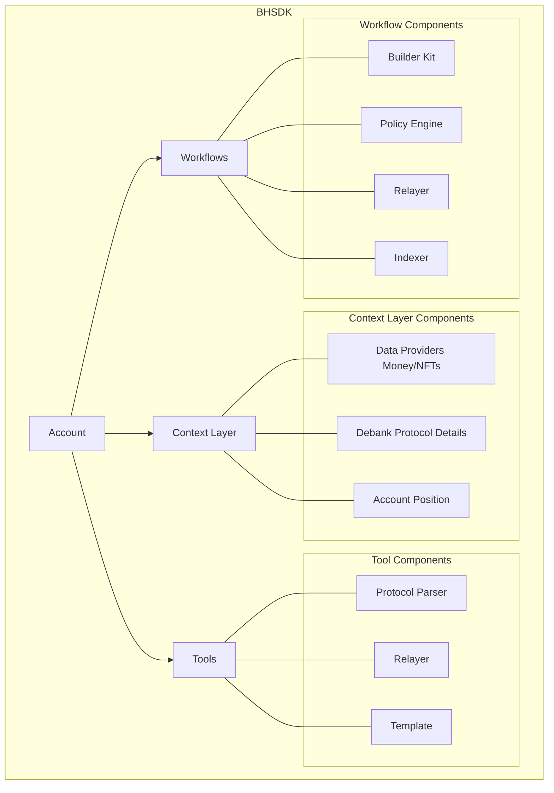

# Introduction 

Brahma sdk (bhsdk) is platform that enable agents, developers to operate, transact onchain autonomously. Bhsdk solves many problems that developers and agents face while performing onchain interactions. Most of these revolve around these themes:
1. Secure Interactions
2. Simplified Development
3. Scalable Operations

## Secure Interactions
### How does Bhsdk enable secure interactions?
Bhsdk use's account as the main interaction point with the platform. The account is built with safe [smart contract wallet](https://safe.global/) . The account leverages the [safe gaurds](https://docs.safe.global/advanced/smart-account-guards) and [safe modules](https://docs.safe.global/advanced/smart-account-modules) features to enable programmatic executions without giving up the full custody of the account. The gaurd is powered by `Policy engine` that validates onchain interactions via state updates, transaction simulations and logs.  

## Simplified Development
### How does Bhsdk simplify application code for onchain interactions ?
By shifting the core part of block chain interaction like protcol routes, failed rpc calls, nonce management, gas estimates to platform. There's less application code for dev's to manage and they can focus on their specific usecase and business logic. The native abstractions like tools, workflows and context layer makes it easy to repurpose existing components and build completely new components reducing overhead during development time. 
Coupled with api driven design, developers can use the platform via programming language of their choice. 

## Scalable Operations
### How does Bhsdk help build scalable operations
Devs can build scalable operations that build on one chain with minimal changes to be expanded easily to other chains or entirely multichain. Compared to pure smart contract based developement flow which is often expensive with audit costs and slower iterations.  The account centric model, developers to iterate faster and adapt the changes as per their usecase. Once built the same code can be used by different set of users with thier specific prefrences while infra is taken care by Bhsdk reducing maintainence overhead for developers.  

# Use Cases

# Getting Started
Bhsdk uses brahma account as the main mode of interaction. The account is assisted by tools, workflows and context layer to operate onchain in efficient and secure manner. The core components are open in nature so dev's can always expand capabilities from exisiting ones. 

