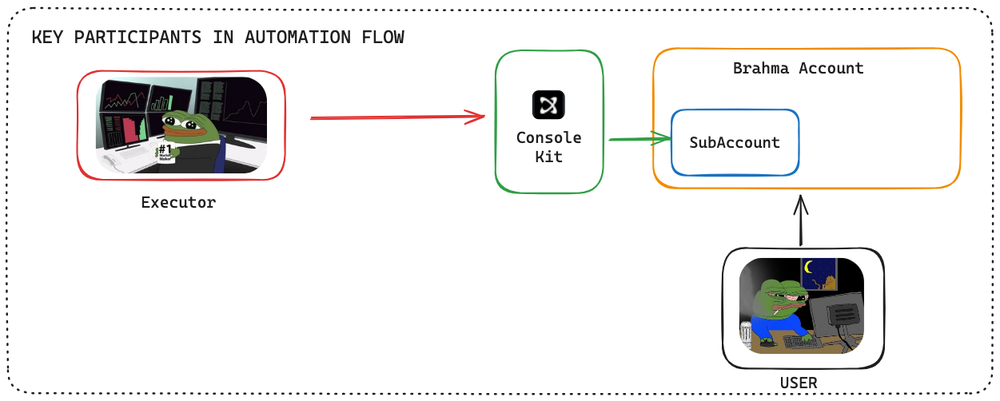
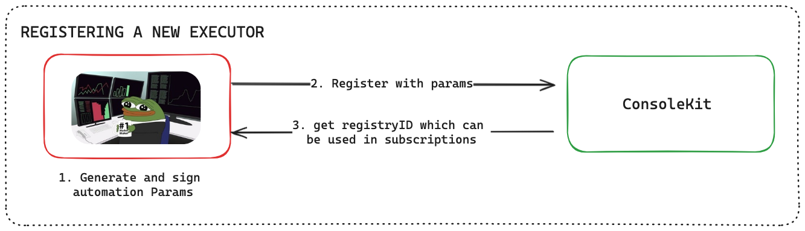

# Executors and Automation Participants

## Key Participants



The automation system in Console Kit involves key participants working together through a policy-secured framework. The user, who owns a Brahma account, can securely delegate access to an executor. All interactions are shielded by policies.

## Understanding Executors

An executor can be any address that wishes to autonomously execute operations on users' subaccounts, such as another smart wallet, an MPC wallet, or any other address, as long as:

- The user has granted access
- Each call made complies with the policy

## Registering Executor

The executor must first register itself using the Console Kit. Once registered, any user can subscribe to the executor and delegate access to requested resources using their subaccount.

### Understanding Policies

When a user subscribes to an executor, the executor transparently shows what policies it will need for execution. This is done using multiple parameters:

- **Hop Addresses**: An array of addresses where the executor would like to move user's funds to. These can be protocol addresses where the users' funds would end up going to. Users subscribing should always verify what addresses the executor is requesting permission to move funds to.

- **Input Tokens**: An array of tokens which the executor is requesting access on and can also be interpreted as the tokens which executor would take as input and use while running the automation.

- **Limit Per Execution**: A boolean that denotes if the policies limits set would apply per execution/transaction or over a duration.

The executor sets these fields for users to view, and the final policy is constructed by the user. Here's an example:

Consider an executor which is an automated token transfer bot that transfers USDC to an address every hour. It creates the following policy intent:

```
hopAddresses: [destinationAddress]
inputTokens: [UsdcAddress]
limitPerExecution: false
```

The user then interprets this policy intent and creates a final policy with their desired amounts:

```
{
    tokenLimits: { UsdcAddress: 100 },
    duration: 3600  // hour in seconds
}
```

This final policy states that the executor can move 100 USDC (100000000) every 3600 seconds to the destinationAddress. Using these combinations, a very fine-grained policy is set which allows a guarded execution environment. Any action outside of this policy or which is not defined in the policy is blocked.

Console Kit abstracts all this complexity and provides simple interfaces to handle executor registration and policy management. Developers can easily set up executors and define policies without dealing with the underlying implementation details.

### Implementation

Console Kit simplifies executor registration and policy management through intuitive interfaces. Developers can implement these features without dealing with complex underlying mechanics.

For implementation details, refer to this [sample executor registration script](https://github.com/Brahma-fi/scaffold-agent/blob/main/kernel-workflow/src/register-executor.ts).
Upon registration, each executor receives a unique registryID (UUID) used for identification across Console Kit.



### [← Introduction](./introduction.md) | [Understanding Subscriptions →](./subscriptions.md)
