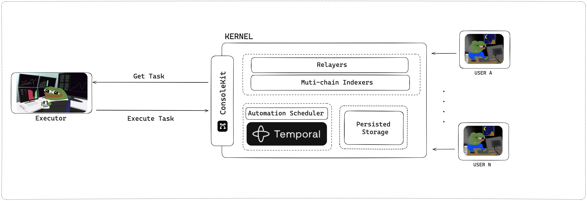
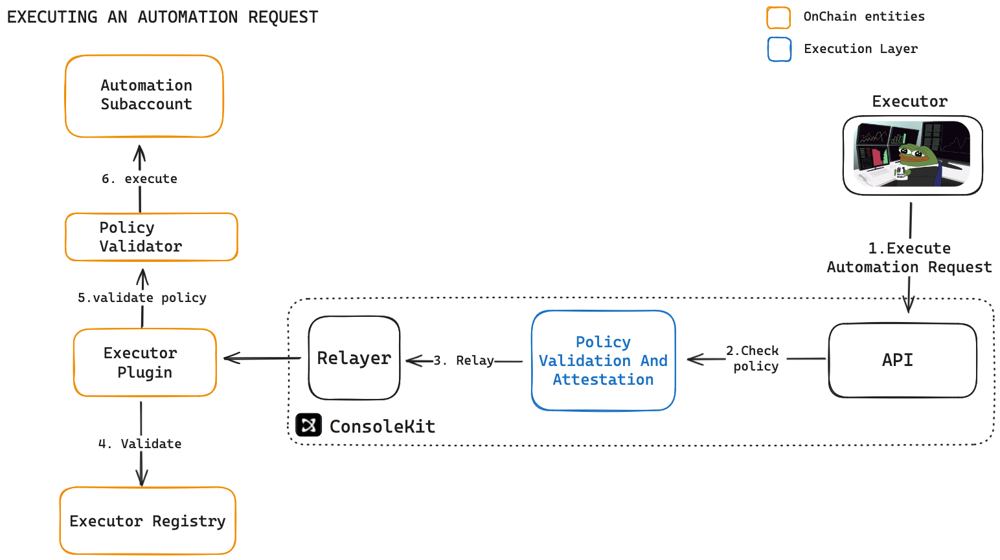

# Hosted Workflows

While executors can independently manage user subscriptions and automation schedules, handling these operations at scale requires significant engineering resources and infrastructure. As subscription volumes grow, developers may find themselves spending more time on operational concerns like scheduling, retry logic, and state management rather than focusing on core automation strategies. Brahma's Kernel service offers a solution by providing a workflow infrastructure that executors can leverage to maintain focus on their core automation logic.

## Overview

Kernel is the orchestration engine that Brahma uses internally to manage automations at scale. Now, external executors can leverage the same infrastructure to handle their subscription management and scheduling complexities. This allows development teams to concentrate on building and optimizing their automation strategies while benefiting from Brahma's workflow management system.



## Integration Process

### 1. Kernel Registration

The first step is registering with Kernel to indicate intent to use the hosted workflow service. During registration, executors provide parameters. This process establishes the connection between the executor and Kernel, sets up configuration for task delivery and processing.

```ts
const ExecutorConfigKernel: KernelExecutorConfig = {
  defaultEvery: "120s", // incase user does not specify how ofter to run users automation, default to this
  executionTTL: "120s", // task should be resolved within this TTL, executor cannot submit the task after this
  type: "INTERVAL", // create a task every given interval, either given by user or defaultEvery
};

const { domain, message, types } =
  await _consoleKit.vendorCaller.generateKernelExecutorRegistration712Message(
    _chainId,
    _registryId,
    ExecutorConfigKernel
  );
const executorRegistrationSignature = await _wallet.signTypedData(
  domain,
  types,
  message
);
console.log("[executor-kernel-sig]", executorRegistrationSignature);

try {
  await _consoleKit.vendorCaller.registerExecutorOnKernel(
    _registryId,
    executorRegistrationSignature,
    ExecutorConfigKernel
  );
} catch (e) {
  console.log(e);
  throw new Error("register executor on kernel fail");
}
```

### 2. Task Polling

Once registered, executors can begin polling for pending tasks. When a trigger hits for any user subscription, Kernel automatically adds the task to the executor's queue. Each task contains the user subscription details, execution context, and all required parameters for generating transactions.

```ts
const tasks = await _consoleKit.vendorCaller.fetchTasks(_registryId, 0, 10); // add pagination if required
```

### 3. Task Execution

When an executor receives a task, it processes the information and generates an execution payload. This payload includes the transactions to be executed on the user's subaccount along with any relevant metadata. The executor submits this payload back to Kernel for processing and once it's executed, it is also saved in execution logs and can be pulled later

```ts
await _consoleKit.vendorCaller.submitTask({
  id,
  payload: {
    task: {
      executable: {
        callType: 0,
        data: calldata,
        to: targetAddress,
        value: "0",
      },
      executorSignature: executionDigestSignature,
      executor: _executor,
      skip: false, // true to skip execution
      skipReason: "", // reason for skipping execution
      subaccount: taskParams.subAccountAddress,
    },
  },
  registryId: _registryId,
});
```

This is a [sample automation agent](https://github.com/Brahma-fi/scaffold-agent/blob/main/kernel-workflow/src/automation-workflow.ts) which executes automated transfer at the users specified frequency

### 4. Lifecycle Management

Kernel manages the complete task lifecycle after submission:

- Relays transactions to the blockchain
- Persists execution logs and maintains history
- Provides status updates and monitoring
- Handles errors and retries when necessary

## Benefits

Using Kernel's hosted workflows provides several advantages:

1. **Simplified Integration**

   - Minimal code required to handle subscriptions
   - No need to maintain complex scheduling logic
   - Built-in monitoring and logging

2. **Stateless Execution**

   - Executors can focus purely on business logic
   - No need to maintain subscription state
   - Automatic task distribution and load balancing

3. **Scalability**

   - Handles thousands of subscriptions efficiently
   - Automatic retry mechanisms
   - Built-in rate limiting and throttling

4. **Reliability**
   - Persistent task storage
   - Guaranteed task delivery
   - Comprehensive execution tracking

## Execution Flow

The execution process of the executors request follows a specific sequence of operations:



## Getting started

You can quickly start building your own automation agent using Kernel by following our scaffold repository:

```bash
git clone https://github.com/Brahma-fi/scaffold-agent.git
cd scaffold-agent/kernel-workflow
```

The scaffold repository provides:

- Complete example implementation
- Ready-to-use boilerplate code

## ### [← Subscriptions](./subscriptions.md) |  [Examples →](./examples.md)
