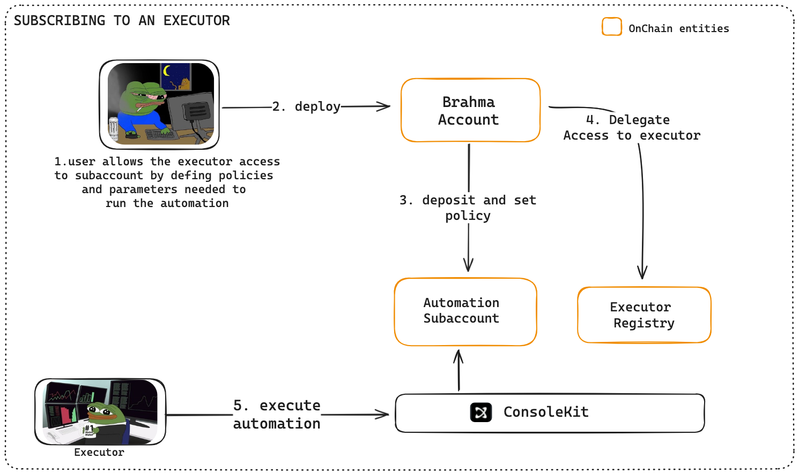

# Understanding Subscriptions

Subscribing to automation in Console Kit enables users to delegate specific permissions to executors through a streamlined onboarding process. The SDK abstracts the complexity of account creation, fund transfers, and permission management into simple, secure operations.

## Onboarding Users

Users can onboard to automation through two primary paths, each designed to provide maximum flexibility while maintaining security.

### Precomputed Addresses

When subscribing to automation, users can start with just their EOA wallet and quickly get set up through a precomputed address flow. This allows users to deposit funds first while account setup happens automatically in the background.

Key aspects of precomputed accounts:

- Designed for users without an existing Brahma account
- Implemented as 1/1 threshold Brahma accounts where the user's EOA is the owner
- Account addresses are deterministically computed before deployment
- Users deposit required automation funds to the precomputed address

Process flow:

1. User transfers funds to the precomputed account
2. SDK generates an EIP712 message containing necessary automation setup information
3. SDK deploys a new Brahma account
4. Creates a dedicated subaccount
5. Sets up the authorized executor gaslessly

This creates a seamless onboarding process for new users.

### Existing Brahma Account

For users with existing Brahma accounts:

- SDK provides built-in functionality to fetch existing Brahma accounts
- Eliminates redundant account deployment for new automation iterations
- Enables efficient resource utilization across multiple automation strategies
- Executors can propose automation subscriptions directly on these accounts

The entire process is abstracted by the Console Kit SDK, providing a seamless experience while maintaining security through policy enforcement. For implementation details, refer to this [sample script](https://github.com/Brahma-fi/scaffold-agent/blob/main/kernel-workflow/src/deploy-automation-account.ts).

### Subscription Configuration

During the subscription process, users must review and configure:

- Executor's requested permissions and policies
- Token limits and allowances
- Execution timeframes and conditions
- All policy parameters as detailed in the [Understanding policies section](./executor.md)

All created Brahma and subaccounts can be accessed via the [Brahma Accounts UI](https://console.brahma.fi/) once deployed.

## Under the Hood

When a user subscribes to automation, several key operations occur behind the scenes:

### [← Understanding Executors](./executor.md) | [Hosted Workflows →](./kernel.md)
